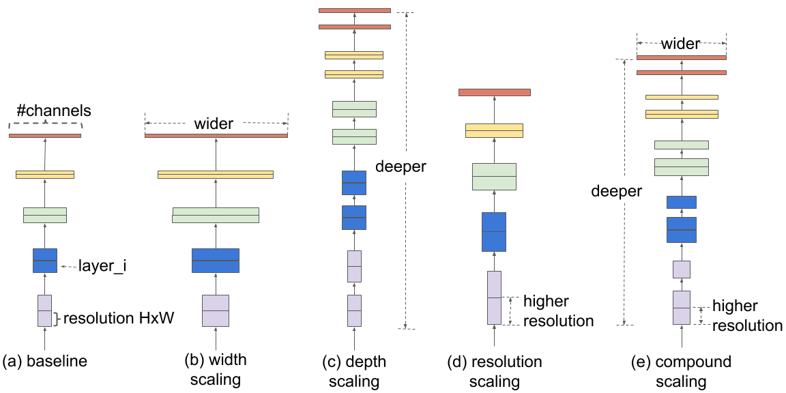

# Predicting Acute Ischemic Stroke Etiology from Whole Slide Digital Pathology Imaging of Clot Composition Retrieved via Mechanical Thrombectomy

Created by Sam Oliver

## Project Overview

In the United States, over 700,000 people suffer an ischemic stroke every year, and stroke is the second most common cause of death in the world. Around 25% of people that have a stroke suffer one or more additional strokes. Identifying stroke etiology improves the likelihood of survival. Stroke Thromboembolism Registery of Imaging and Pathology (STRIP) is a project run by the Mayo Clinic Neurovascular Lab across multiple centers with the following goal: histopathologic characterization of thromboemboli of various etiologies and examining clot composition and its relation to mechanical thrombectomy revascularization. This project will take advantage of resources collected by STRIP to predict stroke etiology (the origin of the stroke). The task of this project is to predict whether a stroke ocurred as one or the other of the main two acute iscehmic stroke etiology subtypes: cardioembolic (CE) or large artery atherosclerosis (LAA). This prediction will be carried out using deep convolutional neural networks that will input images of blood clots that have been extracted from the brain of the patients in this dataset. At this point, it is helpful to define some of the terms noted in this introductory paragraph.

Acute ischemic stroke (AIS): An ischemic stroke refers to a blood clot that blocks or narrows an artery leading to the brain. Acute, in this context, refers to a sudden medical episode related to a pre-existing condition.
Cardioembolic AIS: commonly defined as cerebral vessel occlusion by distant embolization arising from thrombus formation in the heart. CE is essentially the blocking of blood flow in the brain caused by a blood clot in the heart (coronary thrombosis).
Large Artery Atherosclerosis AIS: Atherosclerosis - changes in the walls of blood vessels that occur as a result of inflammation and the accumulation of fatty deposits. Atherosclerosis causes arteries to narrow, which impedes blood flow. Atherosclerotic plaque buildup can then rupture and cause the formation of blood clots that can block arteries in the brain, which can then cause stroke.

To reiterate, the goal of this project is to create useful predictions as to whether a stroke occurred from a clot in the heart or froom large artery atherosclerosis from an image of the removed blood clot from the patient's brain. The point of solving this project is to utizile beneficial prediction methods to then appropriately prescribe therapeutic treatmeant for patients that have suffered one of these kinds of strokes, which allows for more specialized treatment depending on which kind of stroke the patient had and will increase survival odds for the patient.

## The Stakeholder

The stakeholder is the Mayo Clinic, which is offering cash rewards to the creators of the top five best-scoring entries according to a scoring algorithm. The Mayo Clinic is asking for entries to classify images into one of the two major AIS categories for each image in a test set. These two major categories include Cardioembolic (CE) strokes and Large Artery Atherosclerosis (LAA) strokes.

## Navigation Instructions

This project utilizes two Jupyter Notebooks for all the code and data exploration used throughout the project. One of these notebooks was hosted on Google Colab, and this notebook created an allowance of more computational resources that could not be sourced from my own computer. Google Colab allowed for the use of more advanced GPUs and TPUs as well as approximately 32GB of RAM. These resources represent much greater computational capacities than my own machine. The other notebook utilized my own machine. This project also includes some PDFs for the Github repository, the notebooks, and a slideshow of the main findings for this project. This project utilized data from a Kaggle competition run by the Mayo Clinic. This project utilizes the original data provided by the Mayo Clinic as well as other datasets compiled by Kaggle users that were used in order to avoid OOM issues and other issues encountered by the large file sizes of the original images. Links to these datasets and other resources are below.

## Links to Important Resources

1. [Project Presentation]()
2. [Modeling and data exploration carried out on Google Colab](https://github.com/samoliver3/capstone-STRIP-AI/blob/main/STRIP.ipynb)
3. [Modeling and data exploration carried out by local machine](https://github.com/samoliver3/capstone-STRIP-AI/blob/main/og_data_modeling.ipynb)
4. [Original dataset provided by the Mayo Clinic on Kaggle](https://www.kaggle.com/competitions/mayo-clinic-strip-ai/data)
5. [Downsized png dataset](https://www.kaggle.com/datasets/jirkaborovec/stroke-blood-clot-origin-1k-scale-bg-crop)
6. [Tiled dataset](https://www.kaggle.com/datasets/tr1gg3rtrash/mayo-clinic)

### The Data

The dataset provided by the Mayo Clinic contains over a thousand high-resolution whole-slide digital pathology images. Each slide depicts a blood clot from a patient that had experienced an acute ischemic stroke. The dataset contains roughly a 2:1 ratio of CE to LAA blood clots. Some patients have multiple representations of blood clots in the dataset, and there are 11 different clinics that have contributed to the image registry.

A preview of some of the images from each category (CE and LAA) can be seen below.

Spot any differences between the different categories? Differences are not detectable by the human eye, and the medical literature dealing with this subject points to techniques that could potentially unlock feature detection techniques to differentiate between the two; but it is not entirely clear what makes these two major types of strokes different from each other when given an image of the blood clot. However, perhaps the most remarkable work on feature differentiation between the two categories indicates that there might be a significant difference in composition between LAA and CE, especially in % composition of red blood cells. [This study](https://jnis.bmj.com/content/11/11/1145) uncovers potential differences, and a summary of these findings can be viewed below.

It seems like the medical literature on this subject is guiding methodology for discovering feature detection techniques, but differentiation between these two categories is a task for machine and deep learning neural networks. According to the Kaggle competition host, trained medical practicioners are not able to detect differences between these two, and the hope for this project is to facillitate computational learning to create useful predicitons to differentiate the two categories. This notion makes it difficult to guide modeling techniques for feature detection, but it is possible that there are important differences such as the composition of RBCs, dWBCs, fibrin, and other blood components.

The images in the original dataset, the Whole Slide digital pathology dataset, are very large images with sizes that typically range from around .75 GB to 1.5 GB. This size makes it difficult to handle these images and storing just a few of them in memory can easily crash memory. For this reason, I used a variety of techniques including downsizing these images after reading them into memory, using downsized image datasets, and using tiled datasets. The disadvantages of using downsizing techniques is that much of the resolution is lost, which is theoretically very problematic becuase without a direct approach to feature detection, it can be assumed that it is quite possible that signal differentiating the two categories can be easily lost when decreasing the resolution. For this reason, I turned to using a [tiled dataset](https://www.kaggle.com/datasets/tr1gg3rtrash/mayo-clinic) that maintains high resolution and even deletes tiles when the majority of its space is empty. An example of a tile found in this dataset is below.

The entire tiled dataset from this source contains around 120,000 images, and as observed from this example tile, the high-resolution of the original WSI is maintained.

### Methods

First, the data from the original dataset and the downsized png dataset were evaluated and previewed along with various metadata details such as number of clinics contributing images to the dataset, number of images per patient, etc. A simple convolutional neural network was created as a baseline model, and the model simply guessed that each image represented the CE category. This initial model was created with the downsized png dataset for the Colab notebook and with the original WSI dataset for the local notebook. The original basis for this architecture is adapted from Francois Chollet and his blog post titled ["Building powerful image classification models using very little data"](https://blog.keras.io/building-powerful-image-classification-models-using-very-little-data.html). 

After this model, VGG-19 was utilized for the next model's architecture. The architecture of this model can be observed below.

I tweaked some parameters for each model, and I found that an Adam optimizer typically worked well with a moderate to low (1e-6) learning rate. I also used a binary crossentropy loss function for my models as this loss function was fairly compatible with how the Kaggle competition results were scored. This model did predict that some images belonged to the LAA category, but the false positive rate was much higher than the true positive rate, which ultimately indicated that this model performed worse than randomly guessing or simply guessing the CE or LAA category for each image. These kind of results can be depicted below with a confusion matrix.

After this model, I introduced Keras's ImageDataGenerator to permute the images in hopes that these permutations would allow the model to pick up on feature importances. I also allowed for higher resolution of the images (512x512 pixels) as opposed to a smaller resolution in the first VGG-19 model instance that used 256x256 image size to allow the model to read in better quality of images. However, this image quality still is not comparable to the extemely resolute images found in the original WSI imaga dataset, which has a typical image size of around 20k-50k pixels in both height and width parameters. I could not get around losing much of the resolution of these images due to resource constraint. This iteration of VGG-19 indicated that each image in the validation set was CE, which is what the baseline model indicated. 

I then turned to the tiled dataset in the Google Colab notebook. I created a basline model with similar architecture as that of my original baseline model, and I received similar results as my original baseline with the model simply guessing that each validation tile belonged to the CE category.

I saw on Kaggle that some users were supposedly having some small successes with EfficientNet, so I gave this model a try. EfficientNet is a CNN that uniformly scales all dimensions of an image using a compound coefficient. Its architecture can be seen below. 

As seen here, the EfficientNet architecture uniformly scales the dimensions of the images fed in using a fixed ratio. To avoid memory overflow, I used EfficientNetB0, which reads in images as 224x224 size. It would have been nice to read in images at higher resolution, but I kept having issues with OOM, so I stuck with version B0. This model did predict some validations as belonging to the LAA category, but ultimately, it still showed worse results than simply guessing one or the other category or randomly guessing. The confusion matrix for this model shows these results.

I heard some Kaggle users had promising results with Multiple Instance Learning (MIL) modeling, so I also tried this trategy. I implemented this strategy with Keras using [this article](https://keras.io/examples/vision/attention_mil_classification/). MIL is a commonly used strategy for WSI classification problems because WSIs have very high resolutions and typically do not have data specific or compositional-based data labeling within the image. In the context of this problem, it is unclear where the signal is for differentiating between the two categories, and using MIL accompanied with tiled data aims to solve exactly this issue. This model first extracts feature embeddings, feeds these into an attentino layer, and then multiplies features and attention scores together to then create a prediction. More information on the specifics can be found in the Colab notebook or the MIL Keras tutorial. My MIL model predicted that each tiled image in the validation set belonged to one of the classes, which is consistent with much of the other poor results in my other models. There is definitely a lot of room for improvement within how I carried out MIL modeling in this project, and it seems like some of the successful models in the Kaggle competition were able to successfully utilize MIL.
